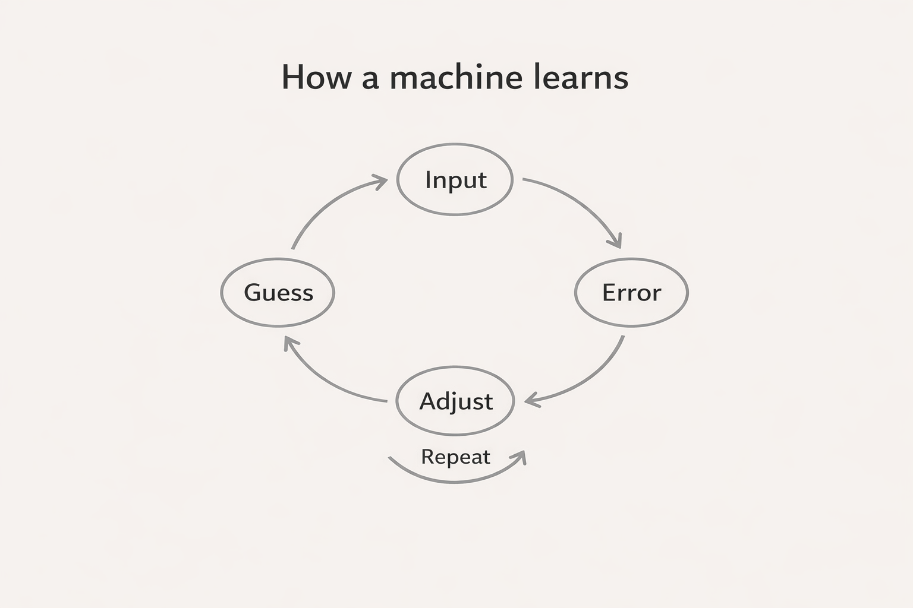

# Topic 1 — How machines learn (without magic)

## The word “learn”

The word “learn” is doing a lot of work here.

When we hear it, we imagine the kind of learning we know: noticing things, understanding them, connecting ideas, remembering what mattered. We imagine something forming inside. A shift. A click.

That is not what happens inside a machine.

---

## The adjustment loop

A machine learns in a much quieter, more mechanical way. It does not understand what it sees. It does not know what it is doing. It only adjusts itself when it is wrong.

That adjustment is the whole process.

A machine is shown something. It makes a guess. The guess is compared to the correct answer. The difference between the two is measured. Then the internal numbers of the machine are nudged slightly so the next guess is less wrong than the previous one. Nothing dramatic changes. Nothing new appears. One small correction happens, and then another, and then another.

This loop repeats so many times that the machine slowly stops making the same mistakes.

That’s what learning is.

---

## What changes inside

Inside the machine, nothing is forming the way it forms inside us. There is no memory building itself into a story. There is no meaning attaching itself to experience. There are only numbers that become more or less likely to be used the next time a similar situation appears.

Over time, these tiny adjustments stack up. Patterns that lead to better outcomes get reinforced. Patterns that lead to worse outcomes fade. The machine starts behaving consistently, and from the outside, that consistency looks like intelligence.

But inside, nothing has changed except the strength of certain paths over others.

---

## Why machines need so much data

This is also why machines need so much data. Humans can learn from a handful of examples because we already carry context and experience with us. Machines don’t. They only see what they are shown, and they need to be shown it again and again until the numbers settle into something stable.

So when we say a machine has learned something, what we really mean is that it has been adjusted enough times that it no longer makes the same errors.

---

## What the machine sees next

The next question is obvious, even if we don’t notice ourselves asking it yet.

What exactly is the machine being shown?  
What does the world look like to it?

That’s where the next topic begins.
