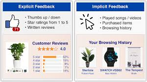

Every time Netflix suggests a show, Spotify generates your Discover Weekly, or Amazon nudges you toward a product you didn't know you needed, a recommendation system is quietly at work. But behind these casual systems lie the use of linear algebra, probability, and behavioral psychology.

## The Core Problem

At its heart, a recommendation system is trying to solve a prediction problem: given a user and a catalog of items, predict which items that user would find most relevant or enjoyable.

This sounds simple, but the challenge is scale and sparsity. A platform like Netflix has millions of users and thousands of titles. Most users have only watched a tiny fraction of available content, which means the user-item interaction matrix (the rows are users and columns are items) is extraordinarily sparse. We're often working with less than 1% of cells filled in.

There are two approaches to solving this: Collaborative Filtering and Content-Based Filtering

## Collaborative Filtering

Collaborative filtering (CF) is the classic approach. It follows a simple principle: If Sam and Mike have liked many of the same movies in the past, they probably have similar taste. So movies Sam liked that Mike hasn't seen yet are good candidates to recommend to Mike.

## Content-Based Filtering

Collaborative filtering has one big weakness: the cold start problem. A brand new user with no rating history has no neighbors. What do you recommend?

Content-based filtering overcomes this by focusing on item features rather than user behavior. Instead of asking "who else is like you?", it asks "what items are similar to items you've already liked?"

A user profile is then built by aggregating the feature vectors of items they've interacted with.

## Implicit vs Explicit Feedback in Recommendation Systems

There are two fundamentally different kinds of user feedback in a recommendation system: explicit and implicit feedback.

### Explicit Feedback

Explicit feedback is when a user directly and intentionally tells the system their preference. The most common forms are:

- Star ratings (1–5 scale)
- Like or dislike buttons
- Favorites or wishlists
- Written reviews

This data is clean and unambiguous. A 5-star rating on a movie means the user loved it. A thumbs down means they didn't.

### Implicit Feedback

Implicit feedback is inferred from user behavior rather than stated preferences. The user never says "I liked this". Instead the system watches what they do and draws conclusions. Common implicit signals include:

- Finishing an article or video (High satisfaction)
- Skipping past content (Low interest)
- Adding to cart without buying (Moderate interest)
- Replaying a song (Strong preference)

## Why Implicit Feedback Dominates in Practice

In the real world, explicit feedback is rare. Most users never rate anything. Studies consistently show that fewer than 1–2% of users on most platforms leave explicit ratings or reviews. Implicit feedback, on the other hand, is generated continuously and automatically by every user interaction. Every click, scroll, and play event is logged. This is why virtually every production recommendation system at scale (Spotify, YouTube, TikTok, Amazon) is primarily trained on implicit feedback, while they also collect explicit feedback.
